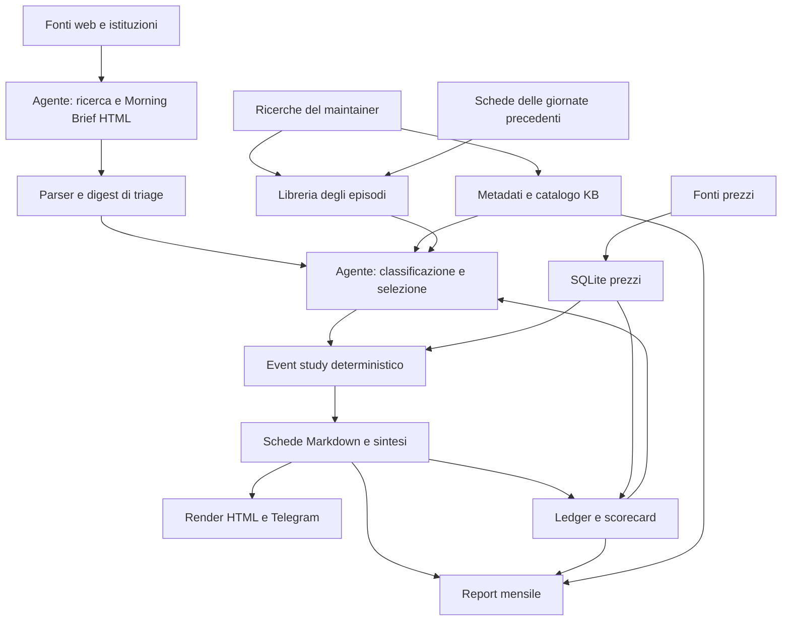

# Revisione di Morning Brief e News-to-Market Impact Pipeline

Revisione svolta il 14–15 settembre 2026. Oggetto: codice e configurazioni locali, istruzioni operative, knowledge base, dati e output disponibili. Nessuna correzione applicata da questa revisione alla pipeline.

**Nota sulla versione esaminata.** Durante la revisione il working tree è cambiato: i wrapper sono tornati a Claude Code ed è stato aggiunto `run_morning_brief.sh` con configurazioni launchd. Questi cambiamenti sono stati riletti nel controllo finale. Le osservazioni sui consumi Codex sono indicate come storiche; i difetti di dati, indicizzazione, parser, scorecard e controlli restano pertinenti al codice esaminato alla chiusura. Non è stato eseguito un nuovo run completo del generatore appena introdotto.

**Valutazione.** L'impianto è sensato: ricerca delle notizie, classificazione dell'agente e calcoli deterministici sono separati; Python, SQLite e Markdown sono adatti a questo sistema. Il punto debole è il contratto fra le fasi: informazioni strutturate diventano prosa, vengono rilette con regex differenti e perdono identità, provenienza o significato. Alcuni controlli verificano che un file esista o che un processo termini, ma non che il risultato sia quello richiesto.

**La priorità per la knowledge base è migliorare l'ingestione delle ricerche già disponibili.** Ho trovato sia episodi reali non estratti, sia date editoriali trasformate in episodi, sia etichette sbagliate. Commissionare altre ricerche senza correggere questi passaggi aggiungerebbe materiale allo stesso processo difettoso.

Le osservazioni distinguono tre livelli: **verificato su file reali**, **riprodotto con dati sintetici isolati**, **rischio statico dedotto dal codice**. I numeri operativi variabili non sono ricopiati come stato del progetto: in fondo sono indicati comandi per ricalcolarli. I valori nei casi sintetici sono input di prova.

## Come è strutturato il sistema

`morning brief/` contiene gli HTML. All’inizio della revisione la generazione era affidata al prompt e ai task; nella versione riletta alla chiusura esiste anche [run_morning_brief.sh](/Users/riccardo/Claude/mercati_finanza/news_impact_pipeline/run_morning_brief.sh), che estrae il prompt canonico e aggiunge lock, watchdog e logging. È un miglioramento di riproducibilità. `mercati_finanza/` contiene il motore, il database, le ricerche e gli output.



Le scelte da conservare sono la classificazione semantica affidata all'agente, i calcoli in Python, il filtro direzionale riferito a uno specifico asset, i veti sulle date dubbie, l'esclusione delle cartelle `_` dagli indici e la separazione fra ricerca scritta dal maintainer e indicizzazione automatica.

## Problemi e interventi proposti

| ID | Priorità | Problema | Tipo di evidenza |
|---|---|---|---|
| R01 | Alta | Nuove ricerche non alimentano i campi richiesti dai filtri direzionali | Codice, file reali e prova isolata |
| R02 | Alta | Eventi diversi nella stessa data vengono fusi | File reali e prova isolata |
| R03 | Alta | Date editoriali e regex producono episodi/etichette errati | File reali e prove isolate |
| R04 | Media | Validazione metadati e rilevamento degli aggiornamenti sono incompleti | File reali, prove isolate e codice |
| R05 | Alta | Prezzi intraday, buchi e revisioni possono restare congelati | Prova isolata e dati reali |
| R06 | Alta | Errori di aggiornamento e invio possono apparire come successi | Prove isolate e codice |
| R07 | Alta | Completamento e retry non verificano l'intera catena | Prova isolata e codice |
| R08 | Media | Il parser perde contenuti/fonti; link del report non portabili | File reali e prova isolata |
| R09 | Alta per la valutazione | La scorecard non identifica in modo univoco previsione, scenario e versione | Prova isolata e ledger reale |
| R10 | Media | Numerosità e IC vengono interpretati con eccessiva sicurezza | Ledger reale, codice e controesempio matematico |
| R11 | Media | Regime e disponibilità temporale sono soprattutto istruzioni narrative | Codice e istruzioni |
| R12 | Media | Il mensile usa una lettura della scorecard non allineata al giornaliero | Codice e istruzioni |
| R13 | Media | Istruzioni duplicate e incompatibili aumentano lavoro e fragilità | Confronto fra file e task |
| R14 | Alta per ottimizzare | La telemetria non misura l'intero consumo della routine | Log, CSV e transcript dei run |

### R01 — Catalogare uno studio non rende utilizzabili i suoi episodi

Il ramo KB di [analogues.py](/Users/riccardo/Claude/mercati_finanza/news_impact_pipeline/analogues.py:453) estrae date ed etichette euristiche, ma non legge i blocchi dichiarati come fa per le schede giornaliere. Non produce `directions_by_reference`. Il runbook e il wrapper richiedono invece `--direction` insieme a `--direction-reference`.

Ho costruito una research di prova contenente una riga dichiarata valida e un riferimento asset: l'episodio generato resta `declared: false` e privo di direzione per asset. Nella ricerca reale sul consumatore USA esistono già righe `Data | Verso | Meccanismo` che non vengono acquisite come dichiarazioni. Il registro di revisione ammette inoltre come fonte soltanto una scheda giornaliera: [analogues.py](/Users/riccardo/Claude/mercati_finanza/news_impact_pipeline/analogues.py:480).

**Conseguenza:** una research può apparire nel catalogo e contribuire date alla libreria, senza ampliare il pool ammesso dalla procedura quotidiana. Il filtro severo è una buona protezione; il problema è l'ingestione che non soddisfa il nuovo contratto.

**Proposta:** definire un formato comune per gli episodi di schede e KB: evento, data/ora dell'annuncio, geografia, istituzione, meccanismo, asset di riferimento, pressione attesa all'epoca, fonte e incertezza. Ammettere revisioni provenienti direttamente dalle ricerche. Misurare separatamente studi catalogati, episodi estratti e disponibilità per la specifica query/asset, senza trasformare automaticamente i versi legacy in dichiarazioni affidabili.

### R02 — La data non è un identificatore sufficiente dell'evento

La chiave della libreria è `(date, theme)`: [analogues.py](/Users/riccardo/Claude/mercati_finanza/news_impact_pipeline/analogues.py:392). Le etichette delle fonti vengono unite; il risultato non conserva la descrizione dell'evento e delle fonti generali resta il conteggio, salvo la provenienza specifica delle direzioni.

Una prova isolata con una release americana sull'inflazione e un diverso evento europeo nello stesso giorno produce un episodio che soddisfa `inflation_print AND eurozone_release`, anche se nessuna fonte descrive un'inflazione europea. Il problema resta anche quando entrambe le dichiarazioni hanno un riferimento asset esplicito.

Nel materiale reale, la ricerca `japan_release AND ism` può recuperare il 1° aprile 2024 perché Tankan giapponese e ISM statunitense sono stati fusi nella stessa data/tema. Un'intersezione fra etichette del record aggregato non garantisce quindi un unico evento pertinente.

**Proposta:** usare un `event_id` distinto dalla data, mantenendo insieme attributi e provenienza dello stesso evento. Selezionare gli eventi pertinenti e soltanto dopo deduplicare le date di mercato per il calcolo dei rendimenti. La deduplicazione degli anchor già presente nell'event study va conservata.

### R03 — Alcune indicizzazioni errate hanno una causa precisa

**Date spurie.** [harvest_kb](/Users/riccardo/Claude/mercati_finanza/news_impact_pipeline/analogues.py:378) cerca date ISO nell'intero corpo. Nella research «Auto-limitazione volontaria dell'offerta…», la riga 81 cita `2026-09-12` come data di una scorecard in una nota tecnica. Quella data è presente nella libreria come episodio `structural_themes`. Questo prova la contaminazione del deposito, non che il falso episodio abbia necessariamente superato anche il filtro direzionale e raggiunto una scheda finale.

**Episodi disponibili ma persi.** La research «Ciclo semiconduttori & AI capex (2023–2026)» contiene una tabella di eventi con date come `24 mag 2023 AC`; l'estrattore restituisce zero date dal suo corpo. Non manca una ricerca sul tema: manca la normalizzazione degli eventi già descritti. Analoghi casi di estrazione nulla sono emersi in altre ricerche; il conteggio va ricavato dallo scanner, non dal numero delle voci nel catalogo.

**Regex troppo larghe.** `ism` in [subtheme_taxonomy.yaml](/Users/riccardo/Claude/mercati_finanza/news_impact_pipeline/subtheme_taxonomy.yaml:440) riconosce anche «Meccanismo»; `utili` alla [riga 129](/Users/riccardo/Claude/mercati_finanza/news_impact_pipeline/subtheme_taxonomy.yaml:129) riconosce «Utilities». Le prove riproducono rispettivamente `activity_growth` e `earnings_shock` senza che il testo descriva quei fenomeni. Nei dati reali il problema riguarda anche episodi Conference Board e Three Mile Island.

**Contesto sbagliato.** La stessa data può comparire nella riga di un evento e nel confine di un regime. `_contexts` raccoglie entrambe le occorrenze: nella research sui dati giapponesi il Tankan del 1° aprile 2024 acquisisce il tema inflazione anche dal paragrafo sul regime successivo, che parla genericamente di CPI.

**Proposta:** leggere gli episodi da una struttura dedicata; distinguere data incerta, alternativa, editoriale e data dell'evento; usare confini di parola per acronimi e parole complete; applicare le etichette ai campi della singola riga. La regola del template «scrivi non-ISO le date da non indicizzare» può essere una precauzione editoriale, ma non deve essere la difesa principale del motore.

### R04 — “Zero warning” non certifica un indice valido

[build_catalog.validate](/Users/riccardo/Claude/mercati_finanza/news_impact_pipeline/build_catalog.py:96) verifica soprattutto presenza dei campi, tema e ticker. Non verifica adeguatamente tipi, valori nulli e struttura degli intervalli. La research BoJ usa stringhe per `time_window` e `regime_phases`, supera il controllo, e [monthly_digest.kb_regimes](/Users/riccardo/Claude/mercati_finanza/news_impact_pipeline/monthly_digest.py:83) restituisce come fase corrente il carattere `)`.

Inoltre catalogo ed episodi leggono i metadati con parser diversi. In prove isolate, YAML valido con `primary_theme: "macro_data"` viene accettato dal catalogo ma perde il tema nell'estrattore; una lista multilinea di sotto-temi viene persa. **Non ho riscontrato queste specifiche differenze di quoting/lista nei metadati correnti:** sono incompatibilità latenti già riproducibili.

[index_studies.sh](/Users/riccardo/Claude/mercati_finanza/news_impact_pipeline/index_studies.sh:50) considera indicizzata un'intera cartella se un qualsiasi Markdown contiene un fence YAML, senza verificarne validità o presenza nel catalogo. La ricerca per mtime non è ricorsiva come il builder, e non rileva bene rimozioni o rinomine. Un secondo studio senza metadati nella stessa cartella può essere saltato.

**Proposta:** un solo parser e uno schema validato; scoperta per file condivisa fra scanner e builder; manifest delle sorgenti basato sui contenuti, comprendente rimozioni; diagnostica di ciò che entra e di ciò che viene escluso. Generare indici temporanei, validarli e pubblicarli atomicamente. Un errore di un file deve essere esplicito e non deve pubblicare silenziosamente un catalogo degradato.

### R05 — L'incrementale non corregge una barra già acquisita

[update_market_data.py](/Users/riccardo/Claude/mercati_finanza/news_impact_pipeline/update_market_data.py:65) riparte da `MAX(date) + 1`, ma il download include la giornata corrente. Una barra scaricata durante la seduta può quindi rimanere definitiva nel database. Nella prova isolata il secondo aggiornamento della stessa giornata non interroga più la fonte: il primo valore resta salvato.

La stessa logica non recupera buchi precedenti all'ultima data, righe prive di prezzo o revisioni dei valori rettificati. Nel database reale sono presenti anche righe con `close` e `adj_close` entrambi nulli. Il semplice conteggio dei ticker del wrapper non rileva questi casi né prezzi vecchi.

**Proposta:** aggiornare una finestra sovrapposta, gestire esplicitamente quando la barra diventa definitiva e riparare buchi/revisioni. La finestra va scelta per fonte e strumento; il solo lookback breve non copre ogni revisione storica. Aggiungere controlli di freschezza e copertura coerenti con i calendari di mercato. Conservare la provenienza e lo stato dei prezzi, senza persistere gli indicatori calcolati.

### R06 — Il successo operativo può essere falso

**Download.** Il ciclo dell'update intercetta gli errori e stampa un messaggio, ma può terminare normalmente anche quando tutti i download falliscono: [update_market_data.py](/Users/riccardo/Claude/mercati_finanza/news_impact_pipeline/update_market_data.py:90). Riprodotto con una fonte finta che fallisce sempre. Il wrapper non controlla gli esiti di tutte le preparazioni prima di avviare l'analisi.

**Telegram.** [send_telegram.sh](/Users/riccardo/Claude/mercati_finanza/news_impact_pipeline/send_telegram.sh:20) non controlla adeguatamente l'errore HTTP né il campo JSON `ok`; scarta la risposta. Con un trasporto finto che restituisce `{"ok":false,"error_code":401}` il codice registra ugualmente gli invii. Se riesce solo uno dei due file attesi, il risultato finale può comunque essere successo: [riga 65](/Users/riccardo/Claude/mercati_finanza/news_impact_pipeline/send_telegram.sh:65).

**Proposta:** esiti strutturati per ogni fase e asset; stato degradato distinto dal successo pieno; verifica della risposta Telegram e ricevuta per ogni artefatto atteso. Un log che dice «inviato» deve derivare da una conferma applicativa, non soltanto dall'assenza di errori del processo `curl`.

### R07 — Completamento analitico, rendering e consegna vanno separati

[index_completo](/Users/riccardo/Claude/mercati_finanza/news_impact_pipeline/run_daily_analysis.sh:99) controlla che l'indice esista e non contenga due segnaposto. Un file completamente vuoto passa: riprodotto chiamando la funzione estratta dallo script. Non vengono verificati corrispondenza con le notizie in ingresso, link alle schede, esistenza delle schede e presenza dei risultati attesi.

Il controllo iniziale esce non appena l'indice è completo. Un rendering o una consegna falliti vengono invece ridotti a warning nella coda: [run_daily_analysis.sh](/Users/riccardo/Claude/mercati_finanza/news_impact_pipeline/run_daily_analysis.sh:410). Al retry, l'indice completo fa uscire prima di riparare proprio quelle fasi.

La configurazione launchd giornaliera include anche `WatchPaths`: l’arrivo del briefing può avviare l’analisi prima dell’orario previsto per l’aggiornamento prezzi. Un calendario non impone da solo una dipendenza fra fasi; occorre verificare la disponibilità dei dati richiesti, non solo il conteggio dei ticker. È un rischio dedotto dalla configurazione, non un incidente nuovo dimostrato.

**Proposta:** stati distinti per input validato, dati pronti, triage completato, schede validate, HTML prodotto e consegna confermata. Legarli all'identità/contenuto dell'input, non soltanto alla data. Il retry deve ripartire dalla prima fase incompleta. Le schede già validate possono essere riutilizzate se l'input e le dipendenze non sono cambiati: questo riduce anche il consumo dei recuperi.

### R08 — Morning Brief perde informazioni nel passaggio all'analisi

Il parser legge soltanto il primo paragrafo della storia e conserva le fonti come testo, senza URL: [parse_briefing.py](/Users/riccardo/Claude/mercati_finanza/news_impact_pipeline/parse_briefing.py:136). Nell'archivio esistono storie con ulteriori paragrafi di contenuto. Per esempio, la prima notizia del 28 aprile 2026 perde il paragrafo successivo sull'implicazione dell'evento. Anche i link verificabili presenti nel briefing non viaggiano nel dato strutturato.

Il parser richiede inoltre un contenitore `<section>` con `<h2>`, mentre il controllo shell conta soltanto `class="story"` e la chiusura del body. Un HTML sintetico con titolo di sezione e articolo, ma senza contenitore `<section>`, passa quel controllo ed estrae zero notizie. **La scansione dell'archivio reale non ha mostrato storie perse per questa specifica ragione di layout**; il caso è una lacuna del contratto di validazione.

Nel report finale, i link `news_NN.md` del triage non vengono trasformati nelle ancore delle schede incorporate: [render_report.py](/Users/riccardo/Claude/mercati_finanza/news_impact_pipeline/render_report.py:98). Sono presenti anche nel report del 14 settembre. Il file HTML ricevuto su Telegram non contiene i Markdown esterni, quindi quei collegamenti non portano alla scheda attesa.

**Proposta:** conservare tutto il testo di contenuto, separare `Markets` e fonti, mantenere URL e date di pubblicazione, validare con il parser effettivo. Nel renderer convertire i link alle schede in ancore interne. In una fase successiva, far produrre un dato strutturato del briefing e derivarne l'HTML con un template deterministico.

### R09 — La scorecard non rappresenta sempre una previsione univoca

[forecast_tracking.parse_card](/Users/riccardo/Claude/mercati_finanza/news_impact_pipeline/forecast_tracking.py:119) interpreta le mediane delle tabelle come previsioni. Non acquisisce una dichiarazione esplicita del tipo «previsione attiva», «solo statistica descrittiva» o «scenario alternativo». Questo è rilevante perché il runbook prescrive di riportare alcune tabelle senza trarne una previsione direzionale.

La chiave del ledger è data, slug, asset e orizzonte, senza scenario: [forecast_tracking.py](/Users/riccardo/Claude/mercati_finanza/news_impact_pipeline/forecast_tracking.py:228). In una scheda sintetica con due tabelle dello stesso asset/orizzonte e mediane opposte, entrambe vengono estratte ma collidono nella stessa chiave; il backfill conserva la prima. Anche una correzione successiva della scheda non aggiorna automaticamente la registrazione già presente.

Il ricalcolo in sola lettura ha inoltre trovato differenze fra rendimenti realizzati nel ledger e quelli ottenuti dal database attuale. **Questo non prova da solo un errore della formula o individua la causa della revisione dei prezzi.** Prova che mancano informazioni sufficienti per riprodurre alcune valutazioni: il ledger non conserva prezzi e date target utilizzati né la versione del dato, e rivaluta soltanto le righe pendenti.

**Proposta:** forecast esplicita e strutturata, con `forecast_id`, scenario, stato attivo/descrittivo, versione della scheda, data di formulazione e criteri di valutazione. Conservare gli input/provenienza necessari alla riproduzione. Distinguere valutazione congelata al momento e successivo ricalcolo su dati revisionati; non riscrivere silenziosamente il track record.

### R10 — N e IC non bastano per certificare affidabilità

Nel ledger più righe condividono lo stesso asset, anchor e orizzonte, quindi lo stesso rendimento realizzato. Orizzonti sovrapposti e notizie correlate aggiungono dipendenza. È legittimo contare più previsioni se si vuole misurare l'esperienza sulle singole schede, ma il numero di righe non equivale al numero di osservazioni indipendenti per stimare l'incertezza.

La scorecard associa giudizi come «affidabile» o «controproducente» a soglie di IC e numerosità: [forecast_tracking.py](/Users/riccardo/Claude/mercati_finanza/news_impact_pipeline/forecast_tracking.py:669). Il runbook arriva a interpretare IC negativo come segno sbagliato più spesso che giusto. Sono proprietà diverse: previsioni `[1,2,3,4]` e realizzati `[4,3,2,1]` hanno IC di Spearman −1 e tutti i segni corretti.

**Proposta:** distinguere accuratezza del segno, capacità di ordinare le magnitudini e copertura degli intervalli. Mostrare anche unità temporali distinte e valutare l'incertezza con raggruppamento per giornata/evento e finestre sovrapposte. Validare eventuali decisioni di filtrare o invertire segnali su periodi successivi a quelli usati per scegliere la regola. Fino ad allora, usare etichette più prudenti e non presentare un IC negativo come prova automatica che invertire il segno funzioni.

### R11 — Regime e no-look-ahead non sono ancora vincoli completi del motore

Il matcher del catalogo assegna punti a tema, sotto-temi, asset e keyword; la libreria filtra etichette, direzione e recency. Non applica una compatibilità strutturata dei regimi. Tenere gli episodi più recenti non garantisce che appartengano allo stesso regime.

`--before` filtra la data degli eventi: [analogues.py](/Users/riccardo/Claude/mercati_finanza/news_impact_pipeline/analogues.py:544). L'event study legge invece la serie disponibile nel DB senza un cutoff `as_of`. In una ricostruzione retrospettiva, un evento precedente alla data di analisi può avere una finestra T+N che supera quella data; le etichette possono inoltre provenire da documenti scritti dopo. Il sistema non impedisce automaticamente queste forme di informazione futura.

Il template delle ricerche usa la seduta di reazione del proxy come data dell'episodio, mentre il motore parte dalla chiusura dell'anchor e misura i giorni successivi. È una convenzione possibile per lo studio della continuazione, ma non misura integralmente la reazione all'annuncio. Serve distinguere annuncio, prima seduta utile e inizio del rendimento misurato, soprattutto con proxy di mercati diversi.

**Proposta:** documentare esplicitamente la quantità descrittiva misurata; separare data evento e anchor per asset. Aggiungere `as_of`, maturazione degli orizzonti e provenienza temporale alle ricostruzioni. Definire poche dimensioni di regime motivate e verificabili prima di aggiungere un classificatore complesso. L'uso descrittivo odierno e un backtest storico rigoroso devono avere requisiti espliciti differenti.

### R12 — Il report mensile usa una versione precedente del metodo

[monthly_digest.latest_scorecard_excerpt](/Users/riccardo/Claude/mercati_finanza/news_impact_pipeline/monthly_digest.py:69) incorpora la sintesi e la sezione per tema, non la tabella per asset 5-bis. La sintesi può citarla, ma non fornisce la tabella. [PHASE6_RUNBOOK](/Users/riccardo/Claude/mercati_finanza/news_impact_pipeline/PHASE6_RUNBOOK.md:9) contiene ancora affermazioni fisse sull'edge per tema e sul suo decadimento con l'orizzonte, mentre il giornaliero richiede una lettura aggiornata per asset.

La tabella per tema usa ancora una correlazione aggregata fra asset: [forecast_tracking.py](/Users/riccardo/Claude/mercati_finanza/news_impact_pipeline/forecast_tracking.py:657). Questo reintroduce proprio il tipo di aggregazione che la vista principale ha cercato di correggere. La funzione dei regimi prende inoltre l'ultima fase elencata, senza selezionarla per data del report.

**Proposta:** allineare mensile e giornaliero a un'estrazione comune della scorecard; distinguere aggregazioni per asset e per tema; selezionare scorecard e regimi coerenti con la data di valutazione. Eliminare dal prompt le conclusioni numeriche o direzionali fisse.

I report storici incompleti di giugno e agosto sono stati verificati: **il validatore mensile attuale li respinge già**. Non considero quindi l'assenza storica di alcune sezioni un difetto ancora privo di controllo. Resta da completare il processo di consuntivo delle previsioni mensili, senza confonderlo con il ledger giornaliero.

### R13 — Le istruzioni hanno accumulato copie divergenti

Il wrapper, PHASE5, il template scheda, i riferimenti e i prompt dei task ripetono regole simili. Il nuovo wrapper del briefing evita correttamente un’altra copia del prompt. Restano divergenze che non sono soltanto terminologiche:

- Il prompt canonico del briefing e il wrapper ammettono edizioni parziali, mentre il controllo programmato di salute richiede ancora esattamente venti storie.
- Il template del glossario dice di non rispiegare le sigle nelle schede, mentre PHASE5 ne prescrive l'espansione e la spiegazione. La scelta editoriale va resa unica.
- «Scrivi il file una volta sola» convive con una procedura che crea prima lo scaffold e poi lo modifica. Non è un problema creare uno scaffold deterministicamente, ma l'agente riceve un divieto assoluto che descrive male il flusso.
- «Non rileggere ciò che hai appena scritto» confonde il risparmio di contesto con l'assenza di verifica: una scrittura riuscita non certifica contenuto e collegamenti corretti.
- Il recupero DB conserva un fallback FRED per lo spread che [quando_si_rompe.md](/Users/riccardo/Claude/mercati_finanza/references/quando_si_rompe.md:206) vieta, perché produrrebbe una serie mensile al posto della giornaliera.

**Proposta:** una specifica operativa canonica, prompt dei task brevi che la referenziano, template compatibili e controlli generati dallo stesso contratto. Spostare cronologie e post-mortem fuori dalle istruzioni caricate a ogni run. Separare regole editoriali, parametri e spiegazioni storiche.

Lo stato ACTIVE/PAUSED dei task non è stato modificato da questa revisione. Il ritorno a launchd richiede un passaggio di consegne esplicito: un solo scheduler proprietario per fase, controllando sia le automazioni dell’app sia i servizi caricati. Configurazione presente, servizio abilitato e servizio effettivamente caricato sono condizioni diverse. I comandi in fondo permettono di verificarle; non basta la documentazione della migrazione precedente. Il controllo di salute deve usare le stesse regole del produttore.

### R14 — I consumi sono misurati solo in parte

**Configurazione attuale riletta.** [record_claude_usage.py](/Users/riccardo/Claude/mercati_finanza/news_impact_pipeline/record_claude_usage.py:14) registra ora turni, token, costo riportato dal client e durata. Il giornaliero scrive `usage.csv` e il nuovo briefing `usage_brief.csv`: questo migliora la copertura rispetto alla configurazione iniziale. Indicizzazione e mensile, però, non usano lo stesso registratore. Mancano identità del run, modello, fase e stato finale; i campi mancanti diventano zero e un JSON malformato non genera una riga di tentativo fallito.

**Osservazione storica sulla configurazione Codex del 14 settembre.** Il registratore allora in uso contava un `turn.completed` come turno: nei CSV risultava un turno mentre i transcript mostravano numerose chiamate agli strumenti. Era il turno logico, non il numero dei passaggi interni, coerentemente con la [documentazione ufficiale del flusso JSONL Codex](https://learn.chatgpt.com/docs/non-interactive-mode). Quel registratore è stato rimosso nel frattempo: non propongo di correggere un file ormai assente.

Il run interrotto delle 09:19 del 14 settembre compare nei transcript con consumo ma non nel CSV. La necessità generale resta: registrare anche tentativi interrotti, errori e lavoro di coordinamento, senza far coincidere «nessun dato di usage» con «nessun consumo». Nel giornaliero il trap può rimuovere il grezzo prima della registrazione; l'assenza di JSON finale richiede recupero o almeno uno stato esplicito di consumo sconosciuto.

I costi riportati dal client Claude, i token Codex e la quota dell'abbonamento sono grandezze diverse. La vecchia media citata nei documenti non va usata come costo attuale o fattura. L'alta quota di input in cache mostra rilettura del contesto, ma da sola non misura il costo monetario o la quota consumata. Anche la legge «il costo cresce col quadrato dei turni» è un modello semplificato di accumulo del contesto, non una legge universale da imporre come istruzione.

**Proposta:** registro unico per esecuzione e fase: identità, modello, inizio/fine, stato, tentativo, token input/cache/output, chiamate agli strumenti e artefatti validati. Recuperare il consumo anche dei run interrotti. Misurare consumo per scheda utile e per giornata completata, comprendendo coordinamento, recuperi e ricerche; non solo il run che termina bene.

## Come ridurre i consumi senza impoverire l'analisi

| Intervento | Perché può risparmiare | Come verificare che non peggiori la qualità |
|---|---|---|
| Conservare descrizione e fonte degli episodi | Evita di ricostruire e riscrivere le stesse spiegazioni storiche | Confrontare motivazioni, riferimenti e tempo di selezione |
| Preparazione deterministica unica del giorno | Evita molte letture separate di asset, scorecard e catalogo | Stessi input e stesse regole di classificazione |
| Query e calcoli batch per le notizie consolidate | Riduce passaggi e output intermedi ripetuti | Confronto esatto delle tabelle numeriche |
| Template deterministico per HTML e tabelle | Il modello scrive analisi, non riproduce impaginazione e scaffold | Controlli strutturali e verifica dei link |
| Ripresa per fase e per scheda validata | Evita di rifare tutto dopo un errore finale | Nessun artefatto obsoleto riutilizzato con input cambiato |
| Estratti KB mirati e comandi con output compatto | Riduce il contesto ripagato nei passaggi successivi | Verificare che gli estratti includano caveat e provenienza |
| Istruzioni canoniche più brevi e strumenti pertinenti alla routine | Riduce contesto fisso, conflitti e riletture | Confrontare errori, astensioni e interventi manuali |
| Classificazione iniziale strutturata; modello più capace sui casi difficili | Permette di concentrare il lavoro costoso dove serve | Valutazione su giornate rappresentative, con criteri fissati prima |

La configurazione precedente consumava token anche nei task che avviavano un altro agente o lanciavano solo Python. Il ritorno a launchd può eliminare questa parte del coordinamento: va misurato dopo il completamento della migrazione, senza attribuirle risparmi non ancora osservati. La priorità di processo è evitare che entrambi gli scheduler continuino a eseguire la stessa fase.

Non attribuisco percentuali di risparmio a interventi non sperimentati. Il confronto va fatto su giorni con carico simile, includendo briefing, schede utili, nuove ricerche, retry e qualità finale. Le ottimizzazioni dei cicli Python o del piccolo rebuild del crack spread sono secondarie rispetto al lavoro ripetuto dell'agente.

## Come ampliare meglio la knowledge base

Il processo proposto mantiene al maintainer la scrittura delle research e la decisione di avviarle.

1. **Classificare la lacuna.** Separare ricerca mancante, evento non estratto, etichetta errata, direzione non verificata, asset non disponibile, regime incompatibile e campione piccolo. Oggi casi diversi rischiano di produrre la stessa richiesta di nuova ricerca.
2. **Recuperare il patrimonio esistente.** Normalizzare tabelle/date già presenti e acquisire dichiarazioni e fonti per evento. Le ricerche sui semiconduttori mostrano che esistono già informazioni inutilizzate.
3. **Validare prima della pubblicazione.** Lo schema deve controllare tipi, date possibili, ticker, provenienza, incertezza e confini degli eventi. Aggiungere query rappresentative con risultati attesi e casi negativi: un Tankan non deve diventare un ISM americano per unione delle fonti.
4. **Mostrare il contributo marginale.** Per ogni ricerca nuova o normalizzata, produrre un confronto degli episodi realmente aggiunti, delle query che migliorano e delle esclusioni motivate. Il conteggio dei documenti non misura il valore della KB.
5. **Ordinare le richieste al maintainer.** Usare ricorrenza delle lacune, importanza per i contenuti, copertura degli asset e diversità dei regimi. Per una lacuna di etichettatura, proporre una revisione dell'indice; per una lacuna di evidenza storica, descrivere la ricerca necessaria. Il prompt di research resta su richiesta esplicita.

## Struttura del codice e manutenzione

Conviene mantenere lo stack attuale e introdurre gradualmente componenti condivisi per configurazione dei percorsi, ontologia, schema dei dati, lettura degli eventi e stato delle esecuzioni. Oggi CLI, logica di dominio, rendering e alcune istruzioni lunghe convivono negli stessi moduli; varie costanti sono replicate. Il legame documentato fra `bootstrap_market_data.py` e `update_market_data.py` va preservato.

Ulteriori interventi circoscritti emersi dalla lettura:

- **Dipendenze riproducibili:** `export_to_excel.py` importa `openpyxl`, che manca in `requirements.txt`; mancano inoltre versioni vincolate per riprodurre l'ambiente. L'export può funzionare nel venv presente ma fallire in un'installazione pulita.
- **Lock omogenei:** scorecard, indicizzazione e mensile hanno lock directory senza recupero basato su proprietario/scadenza; il recupero PID del giornaliero ha una finestra di concorrenza non atomica. Rischi dedotti dal codice, non nuovi incidenti osservati.
- **Guardie sulle serie derivate:** `compute_crack_spread.py` può sostituire lo storico con un risultato vuoto; il refresh spread controlla una numerosità minima, ma non tutta la copertura che verrà sostituita. Verificare copertura e freschezza prima della transazione.
- **Backfill manuale spread:** [fetch_daily_spread.py](/Users/riccardo/Claude/mercati_finanza/news_impact_pipeline/fetch_daily_spread.py:196) avverte quando manca una data di controllo, ma scrive ugualmente, diversamente dal controllo obbligatorio descritto. Riprodotto su DB temporaneo.
- **Fonte dello spread:** la descrizione in `ASSETS` è ancora mensile/FRED e viene riscritta dall'update; va corretta nella fonte del registro, non solo nel DB. Il fallback automatico giornaliero→mensile richiede una correzione coerente con R13.

## Verifiche svolte e limiti

Sono stati esaminati i moduli di acquisizione e aggiornamento prezzi, le serie derivate e importazioni, parser/digest, catalogazione, estrazione e matching degli analoghi, event study, tracking, rendering/export, wrapper, template, runbook, riferimenti di metodo e configurazioni locali dei task pertinenti. Le research sono state controllate nei metadati e in campioni mirati dei contenuti; non è stata verificata online ogni loro affermazione storica, né ogni notizia del briefing.

Controlli effettuati:

- Parsing sintattico dei moduli Python di produzione.
- Suite `test_analogues_direction.py` e `test_analogues_match_all.py`: esito positivo.
- Suite shell sulla versione inizialmente esaminata, in copie temporanee con dipendenze simulate e notifiche desktop neutralizzate: esito positivo. Dopo il cambio di wrapper è stata svolta una rilettura statica; non si estende automaticamente quell’esito al nuovo generatore del briefing. I log sono stati letti e confrontati con la copia del wrapper; queste prove non certificano la consegna Telegram o il contenuto economico delle schede.
- Riproduzioni isolate per perdita dei metadati, dichiarazioni KB ignorate, falsa intersezione, barra intraday non aggiornata, fallimento download non propagato, collisione di scenari, falso successo Telegram, indice vuoto accettato e divergenza fra guardia HTML e parser.
- Lettura del DB in modalità `mode=ro`, controllo di integrità, confronto del ledger con i rendimenti ricalcolati, scansione dei briefing e controllo dei report mensili storici.

Non è stato eseguito `run_tests.sh` completo sul progetto: la suite asset invoca l'aggiornamento reale del DB. Non sono stati effettuati download prezzi, ricerche a pagamento, invii, ricostruzioni degli indici live o modifiche delle automazioni. Le modifiche presenti all’inizio e quelle sopraggiunte durante la revisione sono state rispettate. Questa revisione ha creato soltanto il report; le prove diagnostiche sono rimaste in directory temporanee.

I test verdi sono coerenti con i bug trovati: le suite esistenti coprono diversi guardiani e filtri, ma non tutti i contratti fra ingestione, identità dell'evento, metadati e consegna.

## Comandi di verifica e misurazione

Partire da `/Users/riccardo/Claude/mercati_finanza`. I seguenti comandi non avviano la routine né gli invii.

```bash
PYTHONDONTWRITEBYTECODE=1 news_impact_pipeline/venv/bin/python news_impact_pipeline/tests/test_analogues_direction.py
PYTHONDONTWRITEBYTECODE=1 news_impact_pipeline/venv/bin/python news_impact_pipeline/tests/test_analogues_match_all.py
sqlite3 -readonly market_data/market_data.db 'PRAGMA quick_check;'
sqlite3 -readonly market_data/market_data.db 'SELECT ticker, MAX(date), SUM(close IS NULL AND adj_close IS NULL) FROM prices GROUP BY ticker;'
PYTHONDONTWRITEBYTECODE=1 news_impact_pipeline/venv/bin/python news_impact_pipeline/analogues.py stats
rg '^(name|status|model|reasoning_effort) =' /Users/riccardo/.codex/automations/*/automation.toml
launchctl print-disabled gui/$(id -u) | rg newsimpact
launchctl print gui/$(id -u)/com.riccardo.newsimpact.daily
launchctl print gui/$(id -u)/com.riccardo.newsimpact.brief
```

Per leggere i consumi registrati, mantenendo separati vecchio e nuovo formato:

```bash
PYTHONDONTWRITEBYTECODE=1 news_impact_pipeline/venv/bin/python - <<'PY'
import csv, statistics
from pathlib import Path
p = Path('news_impact_pipeline/logs')
old = list(csv.DictReader((p/'usage.csv').open()))
print('Claude: run registrati', len(old))
if old:
    print('Costo medio registrato:', statistics.mean(float(r['cost_usd']) for r in old))
for filename in ('usage_brief.csv', 'codex_usage.csv'):
    if (p/filename).exists():
        for r in csv.DictReader((p/filename).open()):
            print(filename, r)
print('Questi CSV non rappresentano ancora il totale di tutte le fasi della routine.')
PY
```

## Ordine degli interventi da scegliere

**Pacchetto A — Integrità operativa:** R05–R07, guardie su spread/serie derivate e completamento verificabile. Obiettivo: prezzi utilizzabili ed esiti attendibili.

**Pacchetto B — Qualità della knowledge base:** R01–R04, con correzione immediata delle regex certe, schema comune e successiva migrazione controllata degli eventi. Obiettivo: rendere utili le research esistenti e impedire nuove contaminazioni.

**Pacchetto C — Attendibilità delle valutazioni:** R09–R12. Obiettivo: sapere cosa viene effettivamente previsto, con quali dati e quale evidenza di affidabilità.

**Pacchetto D — Consumi e manutenzione:** R13–R14, preparazione batch, descrizioni persistenti degli episodi, retry selettivi e template deterministici. R08 include anche correzioni rapide del parser e dei link, utili indipendentemente dagli altri pacchetti.

Questi pacchetti sono proposte di lavoro: nessuno è stato applicato durante la revisione.
